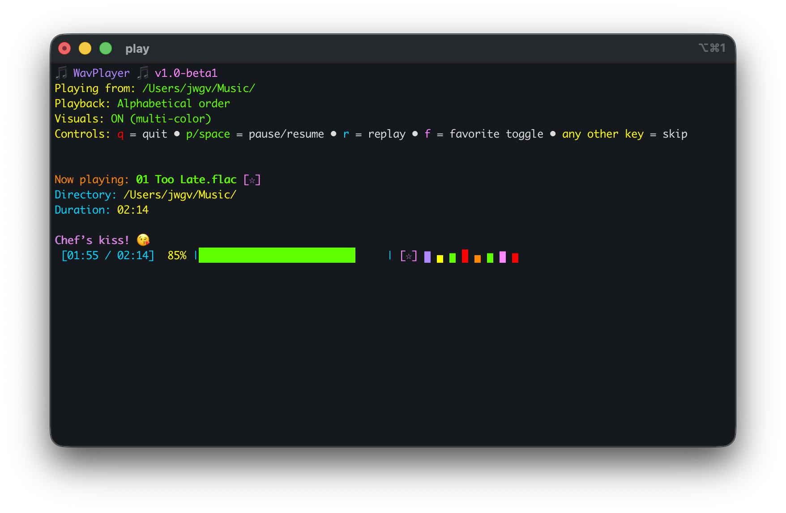

WavPlayer — lightweight terminal music player for macOS

WavPlayer is a single Bash script that plays common audio formats from your music folder without launching Apple Music. It supports alphabetical and random playback, a favorites mode, and an optional colorful terminal visualizer — plus simple keyboard controls.

Key features
- Plays: wav, aiff/aifc, mp3, m4a/aac, flac, ogg
- Alphabetical or random playback (no immediate repeats)
- Favorites-only mode with persistent list in `~/.config/wavplayer/favorites`
- Optional visualizer
  - Multi-color mode (default when `-v` used)
  - Mono-color mode with selectable colors: red, green, yellow, blue, orange, pink, purple
- Pause/Resume, Replay, Skip, and Toggle Favorite
- Respects a config file for default directory: `~/.config/wavplayer/config`
- Works fully in the terminal; no Apple Music required

Dependencies (macOS)
- ffmpeg (decode/seek many formats)
- sox (provides the `play` command for audio output)
- macOS `afinfo` (for duration) — included with macOS

Install
Option A — via Makefile (recommended):
```
make install
```
This will:
1) Install Homebrew if missing
2) Install `ffmpeg` and `sox`
3) Install `wavplayer.sh` to `~/.local/bin/wavplayer.sh` and make it executable

Notes
- Ensure `~/.local/bin` is on your PATH so you can run `wavplayer.sh` from anywhere. For zsh (default on modern macOS):
  - Add this to `~/.zprofile` (or `~/.zshrc`):
    ```
    export PATH="$HOME/.local/bin:$PATH"
    ```
  - Then restart your terminal.
- You can choose a different install location with:
  ```
  make BIN_DIR=/usr/local/bin install
  ```

Option B — manual install:
```
brew install ffmpeg sox
mkdir -p ~/.local/bin
cp -f wavplayer.sh ~/.local/bin/wavplayer.sh
chmod +x ~/.local/bin/wavplayer.sh
```

Run
Basic usage (plays from your Music folder by default):
- If installed via Makefile/manual steps into PATH:
```
wavplayer.sh
```
- Or from the project directory without installing:
```
./wavplayer.sh
```

Directory precedence
1) Command-line directory: `./wavplayer.sh [options] /path/to/music`
2) First non-comment line of `~/.config/wavplayer/config`
3) Fallback: `$HOME/Music`

Options
```
-r, --random          Play in random order (no immediate repeats)
-f, --favorites       Play only favorited tracks (from ~/.config/wavplayer/favorites)
-v, --visual          Enable visualizer (multi-color)
    --visual-mono C   Visualizer in single color C
                      C ∈ {red,green,yellow,blue,orange,pink,purple}
-h, --help            Show usage
```

Examples
- Visualizer (multi-color) from a custom folder:
```
./wavplayer.sh -v ~/Music/Albums
```

- Mono-color visualizer in blue + random playback:
```
./wavplayer.sh --visual-mono blue --random
```

- Favorites-only mode (ignores directory; plays the favorites file):
```
./wavplayer.sh -f
```

Controls
- q → quit
- p or Space → pause/resume
- r → replay current track from the beginning
- f → toggle favorite for the current track
- any other key → skip to next track

Favorites
- During playback, press `f` to toggle the current track as a favorite.
- Favorites are stored one per line in `~/.config/wavplayer/favorites` (full absolute paths).
- Start in favorites-only mode with `-f` to play just your starred tracks.



```
Notes
- The script uses `#!/bin/bash` (the macOS system Bash). If you prefer Homebrew Bash, edit the first line to: `#!/opt/homebrew/bin/bash` on Apple Silicon (or `#!/usr/local/bin/bash` on Intel).
- The visualizer shows stylized bars; actual bar shapes and colors vary slightly per refresh.
- Duration is best-effort; if `afinfo` can’t determine it, the player shows `--:--` and estimates progress.

Troubleshooting
- Command not found: `play` → Install sox: `brew install sox`
- Command not found: `ffmpeg` → `brew install ffmpeg`
- No sound → Ensure output device is available and not muted; sox uses CoreAudio by default on macOS.

License
MIT